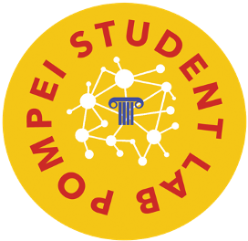

<!-- PROJECT SHIELDS -->
<!--
*** I'm using markdown "reference style" links for readability.
*** Reference links are enclosed in brackets [ ] instead of parentheses ( ).
*** See the bottom of this document for the declaration of the reference variables
*** for contributors-url, forks-url, etc. This is an optional, concise syntax you may use.
*** https://www.markdownguide.org/basic-syntax/#reference-style-links
-->
[![Contributors][contributors-shield]][contributors-url]
[![Forks][forks-shield]][forks-url]
[![Stargazers][stars-shield]][stars-url]
[![Issues][issues-shield]][issues-url]
[![MIT License][license-shield]][license-url]
[![LinkedIn][linkedin-shield]][linkedin-url]


<!-- PROJECT LOGO -->
<br />
<p align="center">
    <h1 align="center">Random Convolutional Kernels for SSVEP Feature Extraction</h1>
     <a href="https://github.com/MachineLearningJournalClub/SSVEP_IEEE_SMC_2021">
    <p align="center">
    
    
  </a>

  <h3 align="center">Steady-State Visual Evoked Potentials (SSVEP) - IEEE SMC 2021</h3>

  <p align="center">
    project_description
    <br />
    <a href="https://github.com/MachineLearningJournalClub/SSVEP_IEEE_SMC_2021"><strong>Explore the docs »</strong></a>
    <br />
    <br />
    <a href="https://github.com/MachineLearningJournalClub/SSVEP_IEEE_SMC_2021">View Demo</a>
    ·
    <a href="https://github.com/MachineLearningJournalClub/SSVEP_IEEE_SMC_2021">Report Bug</a>
    ·
    <a href="https://github.com/MachineLearningJournalClub/SSVEP_IEEE_SMC_2021">Request Feature</a>
  </p>
</p>


<!-- TABLE OF CONTENTS -->
<details open="open">
  <summary><h2 style="display: inline-block">Table of Contents</h2></summary>
  <ol>
    <li>
      <a href="#about-the-project">About The Project</a>
      <ul>
        <li><a href="#built-with">Built With</a></li>
      </ul>
    </li>
    <li>
      <a href="#getting-started">Getting Started</a>
      <ul>
        <li><a href="#prerequisites">Prerequisites</a></li>
        <li><a href="#installation">Installation</a></li>
      </ul>
    </li>
    <li><a href="#usage">Usage</a></li>
    <li><a href="#roadmap">Roadmap</a></li>
    <li><a href="#contributing">Contributing</a></li>
    <li><a href="#license">License</a></li>
    <li><a href="#contact">Contact</a></li>
    <li><a href="#acknowledgements">Acknowledgements</a></li>
  </ol>
</details>


<!-- ABOUT THE PROJECT -->
## About The Project
### Abstract
 During the hackathon we performed analysis on data of an SSVEP experiment. SSVEP stands for Steady State Visually Evoked Potentials and it is a response to visual stimulation. This stimulation is performed at specific frequencies.
 In this particular experiment, the task was to distinguish between four different frequencies. The data we received contained two different patients that performed two sessions of recording each. In each recording, 20 attempts were done, 5 for each frequency.
 Our approach can be divided in two steps.
 First, we applied pre-processing steps on the data, to clean them from unwanted frequencies. These resources can be found in the "Pre-Processing" folder.
 Secondly, the feature extraction and classification has been performed.


### Built With

* [nme](https://mne.tools/stable/index.html)
* [tsai](https://github.com/timeseriesAI/tsai)
* [scikit-learn](https://scikit-learn.org/stable/)


<!-- GETTING STARTED -->
## Getting Started

To get a local copy up and running follow these simple steps.

### Prerequisites

This is an example of how to list things you need to use the software and how to install them.
* npm
  ```sh
  npm install npm@latest -g
  ```

### Installation

1. Clone the repo
   ```sh
   git clone https://github.com/github_username/repo_name.git
   ```
2. Install NPM packages
   ```sh
   npm install
   ```


<!-- USAGE EXAMPLES -->
## Usage

### Preprocessing
The first steps require to clean the data from the unwanted frequencies. In particular, the preprocessing can be divided in the following steps:
* High pass Temporal filtering: it gets rid of slow drifts;
* Spatial filtering: we used Common Average Reference (CAR);
* Indipendent component analysis (ICA);

After that we segmented the data in smaller epochs and divided into the different classes.


### Feature Extraction
### Classification

_For more examples, please refer to the [Documentation](https://example.com)_


<!-- ROADMAP -->
## Roadmap

See the [open issues](https://github.com/github_username/repo_name/issues) for a list of proposed features (and known issues).


<!-- CONTRIBUTING -->
## Contributing

Contributions are what make the open source community such an amazing place to be learn, inspire, and create. Any contributions you make are **greatly appreciated**.

1. Fork the Project
2. Create your Feature Branch (`git checkout -b feature/AmazingFeature`)
3. Commit your Changes (`git commit -m 'Add some AmazingFeature'`)
4. Push to the Branch (`git push origin feature/AmazingFeature`)
5. Open a Pull Request


<!-- LICENSE -->
## License

Distributed under the MIT License. See `LICENSE` for more information.


<!-- CONTACT -->
## Contact

Arianna Di Bernardo - email : [arianna.dibernardo@edu.unito.it](arianna.dibernardo@edu.unito.it) - [linkedin](https://www.linkedin.com/in/arianna-di-bernardo-043370121/)

Beatrice Villata - email : - linkedin

Martina Becchio - email : - linkedin

Simone Azeglio - email : [simone.azeglio@edu.unito.it](simone.azeglio@edu.unito.it) - [linkedin](https://www.linkedin.com/in/simoneazeglio/)

Gabriele Penna  - email : [gabriele.penna04@gmail.com](gabriele.penna04@gmail.com) - [linkedin](https://www.linkedin.com/in/gabriele-penna/)

Luca Bottero  - email : [luca.bottero192@edu.unito.it](luca.bottero192@edu.unito.it)

Project Link: [https://github.com/MachineLearningJournalClub/SSVEP_IEEE_SMC_2021](https://github.com/MachineLearningJournalClub/SSVEP_IEEE_SMC_2021)


<!-- ACKNOWLEDGEMENTS -->
## Acknowledgements

<p align="center">
  <a href="https://github.com/MachineLearningJournalClub/SSVEP_IEEE_SMC_2021">
    
    
    
    
    
      

  </a>

* [Br41n.io IEEE SMC 2021](https://www.br41n.io/IEEE-SMC-2021)
* [NPO Torino](https://www.nposervices.com/)
* [HPC4AI](https://hpc4ai.it/)
* [Pompei Lab](https://www.pompeilab.it/)


<!-- MARKDOWN LINKS & IMAGES -->
<!-- https://www.markdownguide.org/basic-syntax/#reference-style-links -->
[contributors-shield]: https://img.shields.io/github/contributors/MachineLearningJournalClub/SSVEP_IEEE_SMC_2021.svg?style=for-the-badge
[contributors-url]: https://github.com/MachineLearningJournalClub/SSVEP_IEEE_SMC_2021/graphs/contributors
[forks-shield]: https://img.shields.io/github/forks/MachineLearningJournalClub/SSVEP_IEEE_SMC_2021.svg?style=for-the-badge
[forks-url]: https://github.com/MachineLearningJournalClub/SSVEP_IEEE_SMC_2021/network/members
[stars-shield]: https://img.shields.io/github/stars/MachineLearningJournalClub/SSVEP_IEEE_SMC_2021.svg?style=for-the-badge
[stars-url]: https://github.com/MachineLearningJournalClub/SSVEP_IEEE_SMC_2021/stargazers
[issues-shield]: https://img.shields.io/github/issues/MachineLearningJournalClub/SSVEP_IEEE_SMC_2021.svg?style=for-the-badge
[issues-url]: https://github.com/MachineLearningJournalClub/SSVEP_IEEE_SMC_2021/issues
[license-shield]: https://img.shields.io/github/license/MachineLearningJournalClub/SSVEP_IEEE_SMC_2021.svg?style=for-the-badge
[license-url]: https://github.com/MachineLearningJournalClub/SSVEP_IEEE_SMC_2021/blob/main/LICENSE.md
[linkedin-shield]: https://img.shields.io/badge/-LinkedIn-black.svg?style=for-the-badge&logo=linkedin&colorB=555
[linkedin-url]: https://www.linkedin.com/company/machine-learning-journal-club
